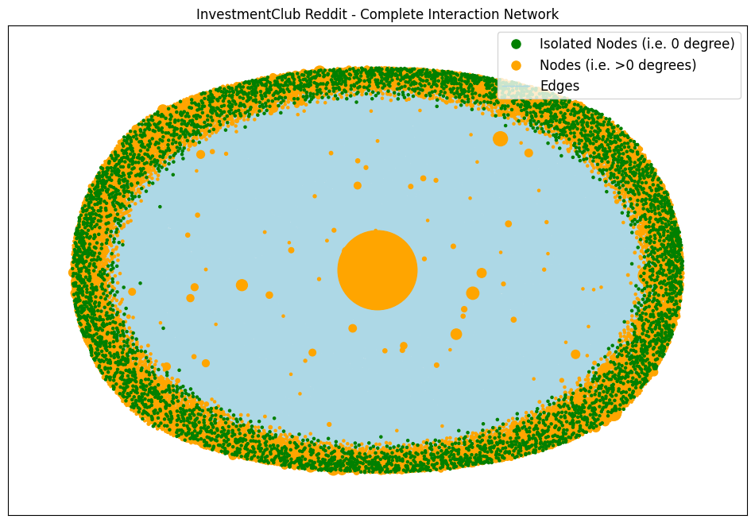
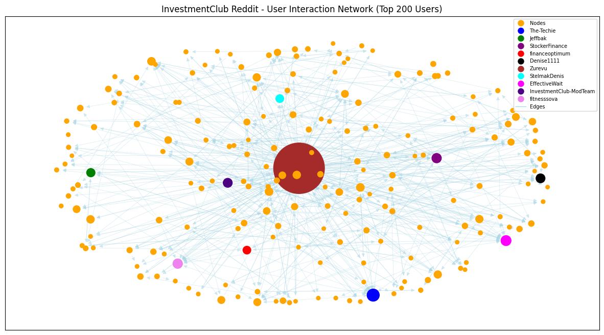
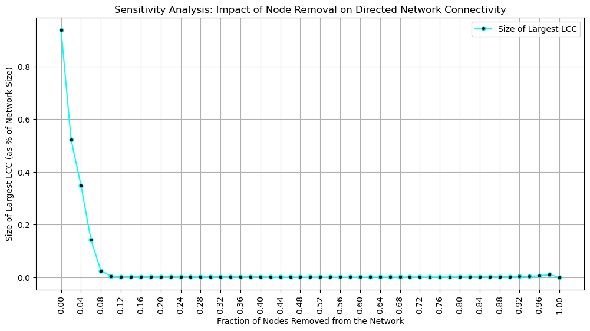

# Reddit InvestmentClub — Social Network Analysis

Analyzing user interaction patterns and influence dynamics within the **r/InvestmentClub** subreddit.  
This project focuses on **network science and time-series engagement patterns** to understand community behavior and influence structure. A brief topic analysis is included to highlight major conversation themes.

## Tech & Tools


 


## Overview

- Built a **directed interaction network** (~12.9K users, 14K+ edges, 10-year data)
- Identified **super-influencers** shaping financial discussions
- Network **collapses when top ~5% users removed**
- **Help-seekers vs help-givers** classification via Z-score analysis
- **Topic modeling (LDA)** to reveal investment themes
- Activity spikes match **major market events**

> Result: The community behaves like a **Q&A financial hub** with a small core of dominant contributors who shape discussions and information flow.

## Key Visualizations

| Full Network (with isolates) | Core Network (Top Users) |
|---|---|
|  |  |

| Network Robustness Test |
|---|
|  |

## Objectives

- Map user-to-user interaction flows
- Identify central & influential users
- Test community resilience to influencer removal
- Analyze posting behavior over time
- Explore main discussion themes

## Methodology

| Step | Techniques |
|------|-----------|
Data Collection | Reddit JSON, Pandas preprocessing  
Network Construction | Directed DiGraph (NetworkX)  
Centrality Analysis | Degree, Eigenvector, Betweenness  
Community Structure | Rich-club, Core-periphery behavior  
Robustness Test | Largest Connected Component (node removal)  
User Role Analysis | Activity Z-Score (help-giver vs seeker)  
Topic Modeling | LDA on high-engagement submissions  
Visualization | Matplotlib, NetworkX layouts

## Key Insights

| Insight | Summary |
|--------|--------|
Influence | Power-law — few users dominate  
Fragility | Removing elites breaks network  
Roles | ~50% help-seekers, ~50% helpers, ~150 hybrid  
Market Reaction | Activity spikes around major events  
Topics | Stocks, macroeconomics, crypto, EVs

## Repository Structure
<pre>
📦 reddit-investmentclub-network-analysis
├── Data/ # Processed data
├── zips/ # Raw JSON data
├── plots/ # Network visualizations
├── NetworkAnalysis_InvestmentClub.ipynb
├── Reddit_Data_Analysis_Coursework_Report.pdf
└── README.md
</pre>

## How to Run

```bash
git clone https://github.com/gaurav-S8/reddit-investmentclub-network-analysis.git
cd reddit-investmentclub-network-analysis
jupyter notebook NetworkAnalysis_InvestmentClub.ipynb
```

### Install Required Libraries (if needed)
```bash
pip install pandas networkx matplotlib scikit-learn
```
