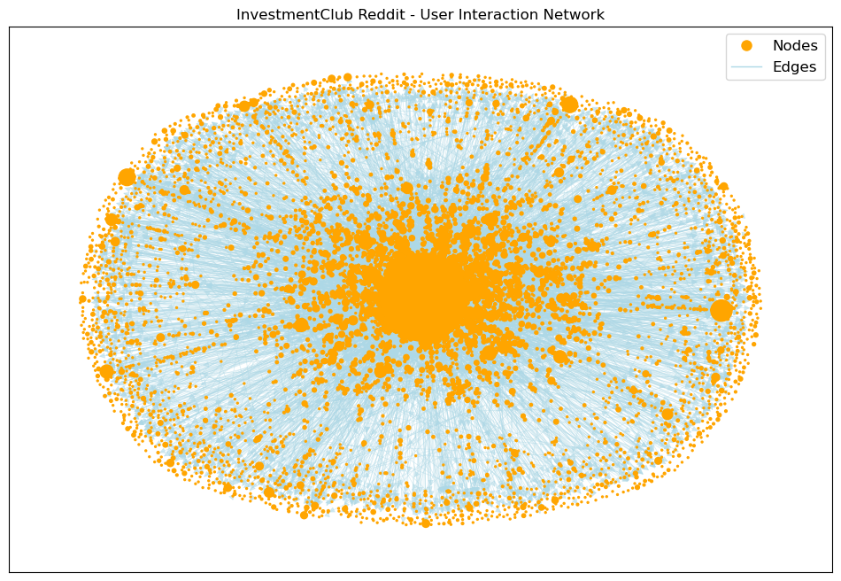
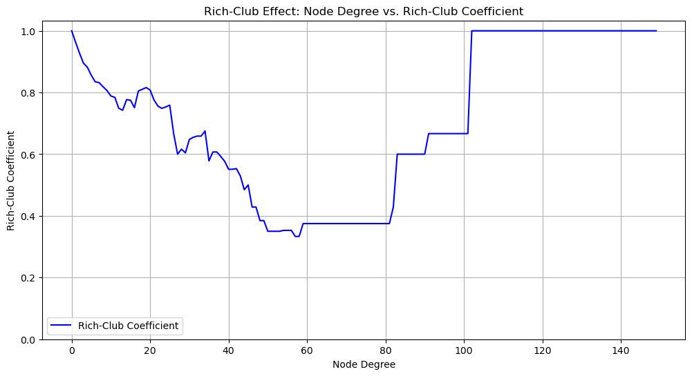
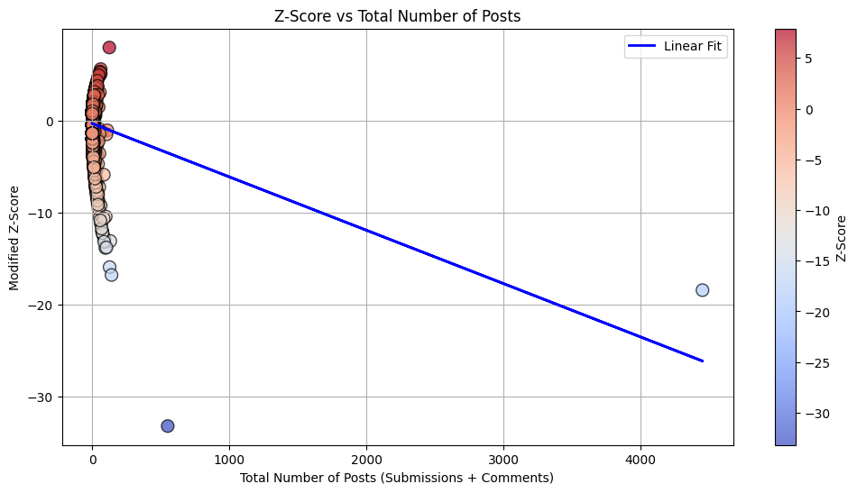

# Reddit InvestmentClub — Network Analysis  

Analyzing user interactions and influence dynamics within the r/InvestmentClub subreddit using social network analysis.


## Overview

This project examines communication patterns in **r/InvestmentClub**, a community focused on stock market and investing discussions.  
We build a **directed interaction network** from Reddit conversations and apply **network science techniques** to analyze participation, influence, and community structure.

Key questions explored:
- Who drives discussions?
- How do users cluster into topic-based sub-communities?
- How resilient is the network if influential users leave?
- Do participation patterns follow financial-social behavior trends?

The analysis highlights **central influencers, community hubs, and help-seeker vs help-giver roles**, as well as how market events trigger spikes in activity.


## Project Goals

- Collect and preprocess Reddit discussion data
- Construct a directed interaction network where  
  - **Nodes = users**
  - **Edges = reply/mention interactions**
- Compute centrality metrics to quantify influence:
  - Degree centrality (engagement)
  - Betweenness centrality (information brokers)
  - Eigenvector centrality (influence in key sub-groups)
- Identify communities and key discussion clusters
- Study how structural patterns reflect investment-focused group behavior


## Project Structure
<pre>
📦 reddit-investmentclub-network-analysis
├── 📁 Data/                         # Processed data for analysis
├── 📁 zips/                         # Raw zipped Reddit dataset
├── 📁 plots/                        # Network visualizations
├── 📄 NetworkAnalysis_InvestmentClub.ipynb   # Main notebook
├── 📄 Reddit_Data_Analysis_Coursework_Report.pdf
├── ⚙️ .gitignore
└── 📝 README.md
</pre>


## Methods

### Data Processing Pipeline
1. Load Reddit dataset (zipped JSON)
2. Parse user-to-user reply chains
3. Remove invalid/unavailable users (`[deleted]`)
4. Build directed edge list: User A → User B (A replies to B)

### Network Construction
- Graph type: **Directed Network (DiGraph)**
- Libraries: `NetworkX`, `pandas`, `matplotlib`
- Metrics computed:
  - Node/edge count
  - Density & connected components
  - Centrality measures
  - Rich-club coefficient & network robustness

## 📊 Key Visualizations & Insights

### 🔍 Full User Interaction Graph (with isolated users)
> ~12.9k users visualized; ~4.6k users are isolated — many users post without interacting.


### 🔎 Active Interaction Network (isolates removed)
> Removing isolates reveals a dense core — active users form a tightly connected financial discussion hub.



### 👑 Top-200 Users Network
> Hub-and-spoke structure — a few “super-users” dominate discussion (*Zurevu* most central).


### 📈 Degree Centrality Ranking
> *Zurevu* has ~17× more connections than the next user — extreme influence concentration.


### 🧠 Network Robustness Test (LCC Attack Simulation)
> Removing top ~5% central users collapses connectivity — network depends on small elite core.


### 👥 Rich-Club Coefficient Curve
> High-degree users selectively connect with each other — “elite cluster” behavior observed.



### 🧾 User Role Classification (Z-Score Analysis)
> ~6.5k help-seekers, ~6.2k help-givers, ~150 hybrids — subreddit functions as a Q&A and advice hub.




## Key Findings

- Participation follows a **power law distribution**, where most users post rarely while a small group is highly active  
- The subreddit is **super user driven**, with a small core shaping most discussions and information flow  
- Removing top users **significantly weakens network connectivity**, showing strong dependence on influential members  
- Interaction patterns indicate the community functions as a **Q&A and learning hub**, with clear help seekers and help givers  
- Activity spikes align with **major market events**, showing high sensitivity to financial news  
- Topic modeling highlights focus on **stocks, macroeconomics, crypto, and market sentiment**


### How to Read the Network Graphs

- **Nodes = users**, **Edges = interactions**
- **Larger nodes** = more central / influential
- **Isolated dots** = users who post but never interact


## How to Run

1. Open `Code.ipynb`
2. Ensure required libraries are installed:

``` bash
pip install pandas networkx matplotlib
```
